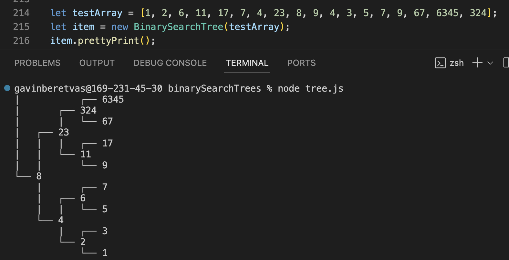

## Binary Search Tree

## Summary 

This project was to familiarize myself with some basic DSA concepts. I constructed a working binary search tree and some manuevering functions in vanilla javascript that can be tested in the terminal using Node.js.

### Technologies

* Vanilla JS/ES6

### Supporting Tools

* ESLint
* Git/GitHub
* Node.js 
* Visual Studio Code

## Features
#### Constructs a class with several methods:
* **buildTree**: takes an array and builds a balanced binary search tree.
* **prettyPrint** (pictured above): visualize the balanced search tree in terminal. (borrowed from the [Odin Project](https://www.theodinproject.com/lessons/javascript-binary-search-trees)).
* **insert/delete**: takes a numerical value and insert/deletes various nodes without rebalancing.
* **find**: takes a value and returns the node corresponding to that value.
* **levelOrder**: traverses the tree in a level order, breadth first, search patern.
* **inOrder/preOrder/postOrder**: traverses the tree in the respective depth order search.
* **height/depth**: takes a node and returns its height/depth on the tree.
* **isBalanced**: checks to see if the tree is balanced and returns a boolean value. 
* **rebalance**: rebalances an unbalanced tree if the tree is unbalanced. 

## License

* [MIT License](https://opensource.org/license/mit/)
* Copyright © 2023 Gavin Beretvas

